  

## 👨‍💻 About Me

I am **Kajan Sivaraja**, a Cybersecurity undergraduate at SLIIT specializing in Cyber Security with hands-on experience in penetration testing, vulnerability assessment, and secure system implementation.

I completed my Cybersecurity Internship at **Safe Project (Pvt) Ltd – SouthAsian Technologies**, where I worked with enterprise security platforms including ManageEngine, Barracuda, SOTI, and Kaspersky. I gained real-world experience troubleshooting security incidents, managing endpoints, and supporting network security operations.

My expertise includes penetration testing using tools such as Nmap, Burp Suite, Metasploit, Nessus, Wireshark, and OWASP ZAP, along with programming in Python, Java, C/C++, and web technologies for secure application development. I actively practice cybersecurity through TryHackMe, Hack The Box, CTF challenges, and vulnerability research.

I am passionate about ethical hacking, network defense, and developing intelligent security tools to protect modern systems.

---

## 🧠 Skills

### 🔐 Cybersecurity Tools

  
  
  
  
  
  

### 💻 Programming

  
  
  
  
  
  

### 🌐 Web & Mobile

  
  
  
  
  
  

##  Projects

### KAJAN Ethical Hacking Toolkit (v1 & v2)
Security toolkit for penetration testing automation including:
- SSH brute force (Hydra)
- Nmap vulnerability scanning
- Subdomain enumeration
- Hash cracking (John the Ripper)
- Threat intelligence lookup (AbuseIPDB)

👉 https://github.com/sksivakajan/kajan-toolkit  
👉 https://github.com/sksivakajan/KAJAN-Toolkit-v2  

---

###  Android Reverse Engineering
- Decompiled APK using Apktool & JADX  
- Bypassed premium restrictions  
- Modified and rebuilt secure APK  

---

### 🛡 GRC Risk Assessment (OCTAVE)
Governance, Risk & Compliance assessment for business infrastructure security.

---

### AI Security & Computer Vision Projects
- Face detection & tracking  
- Object tracking  
- Face recognition  
- Emotion detection  
- Motion detection  

👉 https://github.com/sksivakajan/ai-Project  

---

###  Auto Backup Bash Script
Automated timestamp backup solution for Linux systems.  

👉 https://github.com/sksivakajan/auto-backup-with-timestamp-bash-script  

---

## 🎓 Education

**BSc (Hons) Information Technology — Cyber Security**  
SLIIT, Sri Lanka (2022 – Present)

---

## Internship

**Cybersecurity Intern**  
Safe Project (Pvt) Ltd — SouthAsian Technologies  

- Worked with ManageEngine, Barracuda, SOTI, Kaspersky  
- Supported network & endpoint security operations  
- Troubleshot security incidents and system alerts  
- Managed IT & security tools in enterprise environments  

---

## Certifications

- eJPT — Junior Penetration Tester  
- ICCA — Certified Cyber Security Analyst  
- Ethical Hacker — Cisco  
- SQL Injection — EC-Council  
- Cybersecurity — Cisco  
- Python — HackerRank  

---

## Cybersecurity Practice

- TryHackMe  
- Hack The Box  
- CTF Challenges  
- Bug Bounty Research  

---

## Contact

📧 sivakajan07@gmail.com  
🌐 [https://sivarajakajan.me](https://www.sivakajan.me/)
💼 https://linkedin.com/in/kajan-s-216709245  
🐙 https://github.com/sksivakajan  

---

  🔴 Ethical Hacking • Cyber Defense • Security Research 🔴

